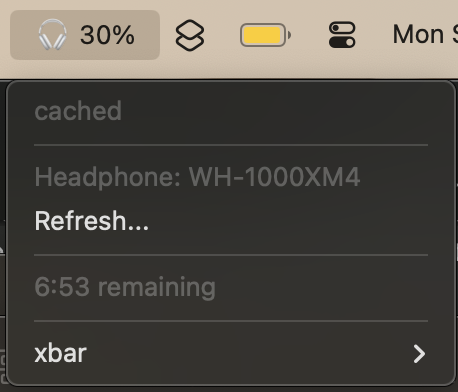

# xbar-plugins
My most used xbar plugins


Assigned and Author PR's
Note: You have to fill out the credential part.
Example
```env
GITHUB_APIKEY="my_github_api_key"
AUTHOR="bycym"
ORG="bycym"
GITHUB_TEAMMEMBERS=["teamMember1", "teamMember2"]
```


Telex RSS feed


Gitlab MR
example env:
```env
CACHE_FILE="not/MR-gitlab.cache"
GITLAB_TOKEN="my_gitlab_token"
AUTHOR_ID="69" # user id
AUTHOR="bycym"
ORG="bycym" # my example host name
HOST="https://gitlab.bycym.com"
```


Foxpost Package status
example env:
```env
CODE="my_foxpost_code"
```


Met.hu radar ([LINK](https://met.hu/idojaras/aktualis_idojaras/radar/))


Headphone battery and remaining battery

